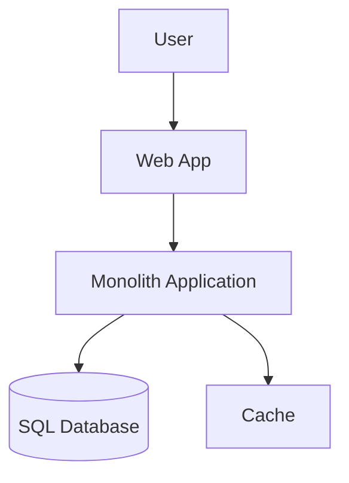
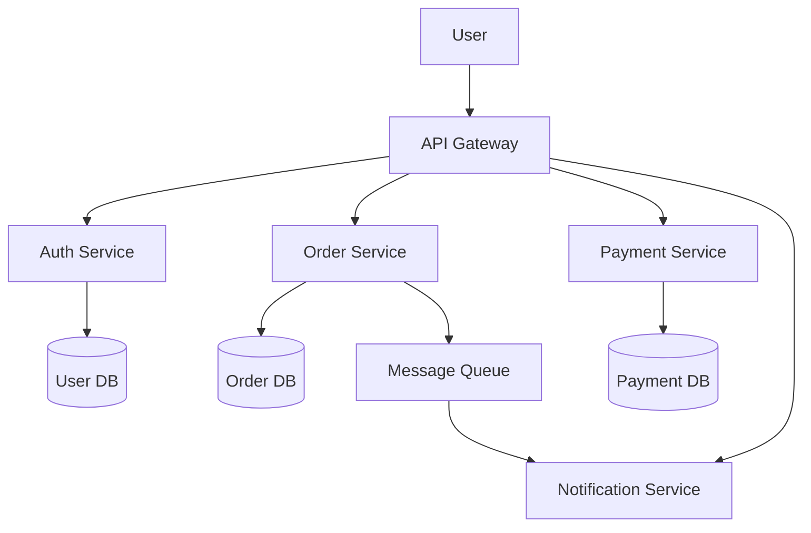
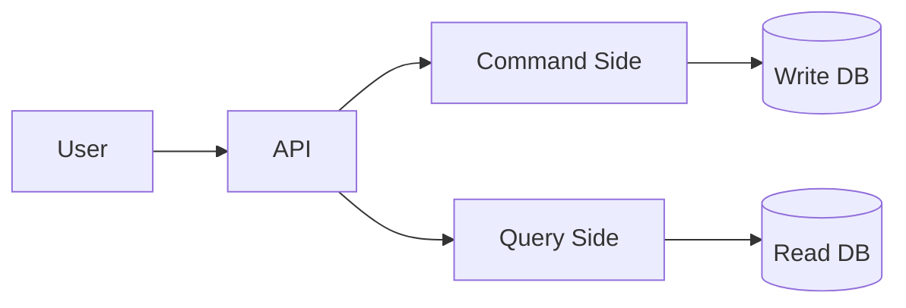
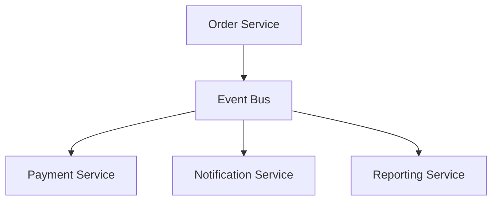

# System Design Diagram Templates

Use these templates in:

- draw.io
- Excalidraw
- Mermaid
- PowerPoint
- Excel

## 1. Context Diagram Template

Use for:

- who uses the system
- what external systems connect

```text
[User]
   |
   v
[Web / Mobile App]
   |
   v
[Main System]
   |------> [Payment Gateway]
   |------> [Email Service]
   |------> [Third-Party API]
```

## 2. Container Diagram Template

Use for:

- system parts at high level

```text
[Client App]
    |
    v
[Load Balancer / API Gateway]
    |
    v
[Backend API]
   |------> [Redis Cache]
   |------> [SQL Database]
   |------> [Message Queue]
   |------> [Notification Service]
```

## 3. Microservices Diagram Template

```text
[Web App]
   |
   v
[API Gateway]
   |------> [Auth Service]
   |------> [User Service]
   |------> [Order Service]
   |------> [Payment Service]
   |------> [Notification Service]

[Order Service] ------> [Order DB]
[Payment Service] ----> [Payment DB]
[User Service] -------> [User DB]
```

## 4. Sequence Diagram Template

```text
User -> UI -> API -> Service -> Database
```

Expanded:

```text
User
  |
  v
UI
  |
  v
API Gateway
  |
  v
Order Service
  |
  +----> Inventory Service
  |
  +----> Payment Service
  |
  v
Database
```

## 5. Deployment Diagram Template

```text
Internet
   |
   v
[CDN]
   |
   v
[Load Balancer]
   |
   +----> [App Instance 1]
   +----> [App Instance 2]
   +----> [App Instance 3]
            |
            +----> [Redis]
            +----> [Primary DB]
            +----> [Read Replica]
```

## 6. Excel Table Template for System Design

Create columns like:

| Service | Purpose | Input | Output | Database | External Dependency | Scale Need | Notes |
|---------|---------|-------|--------|----------|---------------------|------------|-------|
| Auth | login | user credentials | token | user db | oauth provider | high | secure |
| Order | create order | cart data | order id | order db | payment api | high | async events |

## 7. Mermaid Template: Monolith



## 8. Mermaid Template: Microservices



## 9. Mermaid Template: CQRS



## 10. Mermaid Template: Event-Driven



## 11. Practice Exercises

Draw these 5 systems:

1. login system
2. e-commerce order system
3. hospital management system
4. chat application
5. URL shortener

For each system make:

- 1 context diagram
- 1 container diagram
- 1 sequence flow

## 12. Best Learning Rule

Do not only read diagrams.

Do this:

1. draw simple version
2. explain it aloud
3. add one more component
4. explain why that component is needed
